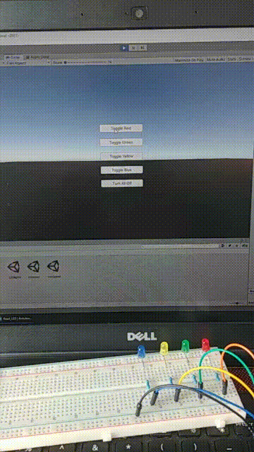
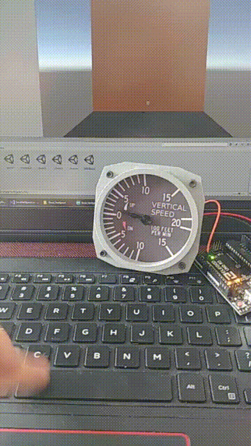
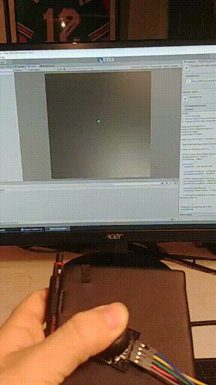
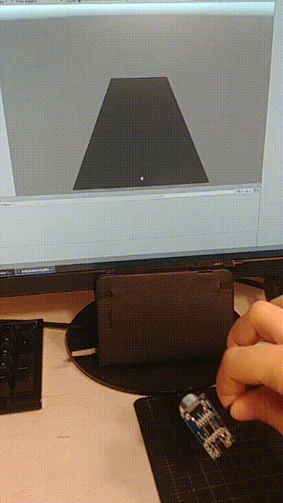

# UnityArduinoToyBox HEAVILY WIP
A Unity Program that takes various Arduino input via Serial

Unity version: 2019.3.0f6

## Button.ino / Button Scene

## Read_LED.ino / LEDlights Scene

## Read_VertSpeed.ino / VertSpeed Scene

# The below are somewhat working, but need heavy work.
I think its because they continuously spam the serial with data, and that data isn't able to be processed quick enough. The below will start to lag behind very quickly.

## Joystick.ino / Joystick Scene

Joystick code needs a lot of work as the deadzone seems large and it has a tendincy to only move along one axis at a time.

## USsensor.ino / USsensor Scene

